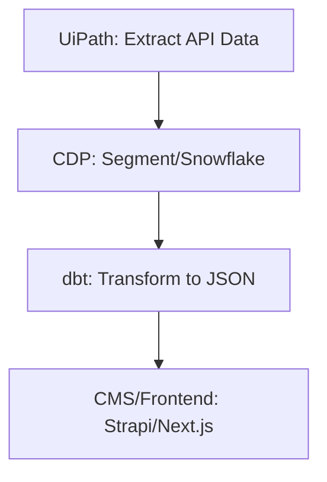

[📄 Return to main branch](https://github.com/rhorn-rm-gh/rhorn-rm-app-project/blob/main/README-Main.md)

## _Note: Unfortunately, I did not have the opportunity to experiment with or pilot this automation. These products are new to me, and I’m enthusiastic about continuing to explore and work with them._

---

Based on your goal—automating the flow from API data files to a customer data platform and then transforming them into JSON for website consumption—here’s a recommended **app stack** that balances automation, scalability, and ease of integration:

---

## 🧱 Recommended App Stack for Automated ELT + Web Integration

### 1. **Automation & Data Extraction: UiPath**
- **Role:** Automates file retrieval from network folders and API calls
- **Key Features:**
  - HTTP Request Wizard for REST APIs
  - File system automation
  - JSON deserialization and transformation
- **Why:** UiPath excels at rule-based automation and can easily handle API data extraction and file manipulation

---

### 2. **Customer Data Platform (CDP): Segment or Snowflake**
- **Role:** Central repository for customer data ingestion and transformation
- **Options:**
  - **Segment**: Ideal for real-time customer data routing and tracking
  - **Snowflake**: Scalable cloud data warehouse with ELT capabilities
- **Why:** These platforms support structured ingestion and transformation pipelines, and integrate well with automation tools

---

### 3. **Data Transformation: dbt (Data Build Tool)**
- **Role:** Transforms raw data into clean, structured JSON
- **Key Features:**
  - SQL-based transformation logic
  - Version control and modular pipelines
- **Why:** dbt works well with Snowflake and other warehouses to produce clean, web-ready data formats

---

### 4. **Web Consumption Layer: Headless CMS or Static Site Generator**
- **Options:**
  - **Strapi** or **Contentful** (Headless CMS): Serve JSON via APIs to frontend
  - **Next.js** or **Gatsby** (Static Site Generators): Consume JSON and render dynamic content
- **Why:** These tools allow seamless integration of JSON data into modern, performant websites

---

## 🔄 Workflow Summary

---

## ✅ Benefits of This Stack
- **Automation-first**: UiPath handles repetitive tasks and API interactions
- **Scalable data infrastructure**: CDP + dbt ensures clean, structured data
- **Modern web integration**: JSON flows directly into dynamic web components

---

Here’s a detailed **step-by-step project plan timeline** to guide your implementation from start to finish. This timeline assumes a **6-week schedule**, but it can be adjusted based on team size, complexity, and available resources.

---

## 📅 6-Week Project Plan Timeline: UiPath → CDP → dbt → JSON → Web

| **Week** | **Phase** | **Goals** | **Key Deliverables** |
|----------|-----------|-----------|-----------------------|
| **Week 1** | 🔍 Requirements Gathering & Planning | Define scope, tools, and data sources | Project charter, tool selection matrix, data inventory |
| **Week 2** | 🏗️ Environment Setup | Prepare infrastructure and access | Installed tools, configured environments, access credentials |
| **Week 3** | 🔄 Automation & Data Ingestion | Build UiPath workflows and ingest data into CDP | UiPath scripts, test data loads, ingestion logs |
| **Week 4** | 🧪 Data Transformation with dbt | Clean and structure data for JSON output | dbt models, transformation logic, test results |
| **Week 5** | 📤 Export & Web Integration | Convert data to JSON and integrate with website | JSON files, CMS/API integration, frontend test pages |
| **Week 6** | 🚀 Deployment & Monitoring | Launch pipeline and set up monitoring | Scheduled jobs, dashboards, documentation, handoff |

---

## 🧭 Detailed Weekly Breakdown

### **Week 1: Requirements Gathering & Planning**
- ✅ Tasks:
  - Meet with stakeholders to define goals
  - Identify API endpoints and network folder structure
  - Choose tools: UiPath, CDP (Segment/Snowflake), dbt, CMS/frontend
  - Review security and compliance needs
- 📌 Deliverables:
  - Project scope document
  - Data flow diagram
  - Tool selection matrix

---

### **Week 2: Environment Setup**
- ✅ Tasks:
  - Install UiPath Studio and configure access
  - Provision CDP (e.g., Snowflake or Segment)
  - Set up dbt locally or in dbt Cloud
  - Prepare CMS or frontend environment
- 📌 Deliverables:
  - Working development environments
  - API keys and credentials
  - dbt project initialized

---

### **Week 3: Automation & Data Ingestion**
- ✅ Tasks:
  - Build UiPath workflows to extract API data and move files
  - Load data into CDP using API or CLI
  - Validate ingestion and handle errors
- 📌 Deliverables:
  - UiPath automation scripts
  - Sample ingested data in CDP
  - Ingestion logs and error handling plan

---

### **Week 4: Data Transformation with dbt**
- ✅ Tasks:
  - Create dbt models to clean and format data
  - Use SQL to structure JSON-ready output
  - Run `dbt test` to validate transformations
- 📌 Deliverables:
  - dbt models and documentation
  - Cleaned data tables
  - Transformation test results

---

### **Week 5: Export & Web Integration**
- ✅ Tasks:
  - Query transformed data and export to JSON
  - Integrate JSON with CMS or frontend
  - Test rendering and data accuracy
- 📌 Deliverables:
  - JSON files or API endpoints
  - Integrated web pages or CMS entries
  - QA test results

---

### **Week 6: Deployment & Monitoring**
- ✅ Tasks:
  - Schedule UiPath and dbt jobs (Orchestrator/dbt Cloud)
  - Set up monitoring dashboards and alerts
  - Document workflows and train stakeholders
- 📌 Deliverables:
  - Scheduled automation
  - Monitoring dashboards
  - Final documentation and handoff

---

[📄 Return to main branch](https://github.com/rhorn-rm-gh/rhorn-rm-app-project/blob/main/README-Main.md)
