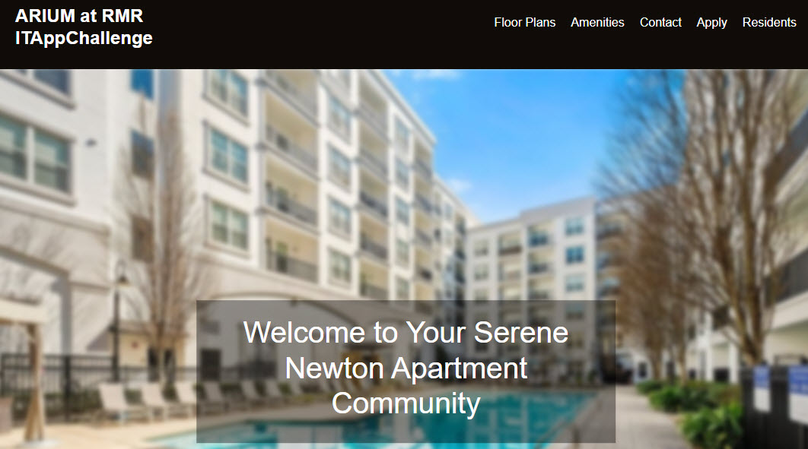

## 📄 Executive Summary

[📄 Preview via Google Docs Viewer](https://docs.google.com/viewer?url=https://docs.google.com/viewer?url=https://raw.githubusercontent.com/rhorn-rm-gh/rhorn-rm-app-project/main/docs/RMR_Executive_Summary-ITAppChallenge2025_rh.pdf&embedded=true)

[📄 Preview Executive Summary](https://github.com/rhorn-rm-gh/rhorn-rm-app-project/blob/main/docs/RMR_Executive_Summary-ITAppChallenge2025_rh.pdf)

# App Projects 🚀

👋 Welcome to the App Projects
These projects demonstrate the power of modern web development and data automation. Each serves as a proof of concept (POC) showcasing:

•	🌐 API integration & bot automation for dynamic workflows

•	📊 ELT (Extract, Load, Transform) in a customer data platform

•	🎨 Web design that brings beauty and functionality together

Crafted with simplicity in mind, each project is easy to follow—perfect for learners and curious minds alike.

🔥 Built with HTML, CSS, and JavaScript, these projects highlight what's possible when creativity meets code.

## Project List 📜
# 10-API-UIPATH 

# 20-ELT-Db 

# 30-WEBSITE - [Preview the site](https://rhorn-rm-gh.github.io/rhorn-rm-app-project/)

### Contact Us

If you have any questions or feedback, feel free to reach out to us. We're always happy to hear from you!

## Acknowledgements

We would like to acknowledge and thank the open-source community for their contributions to this project.

Join us in creating something truly beautiful on the web.
